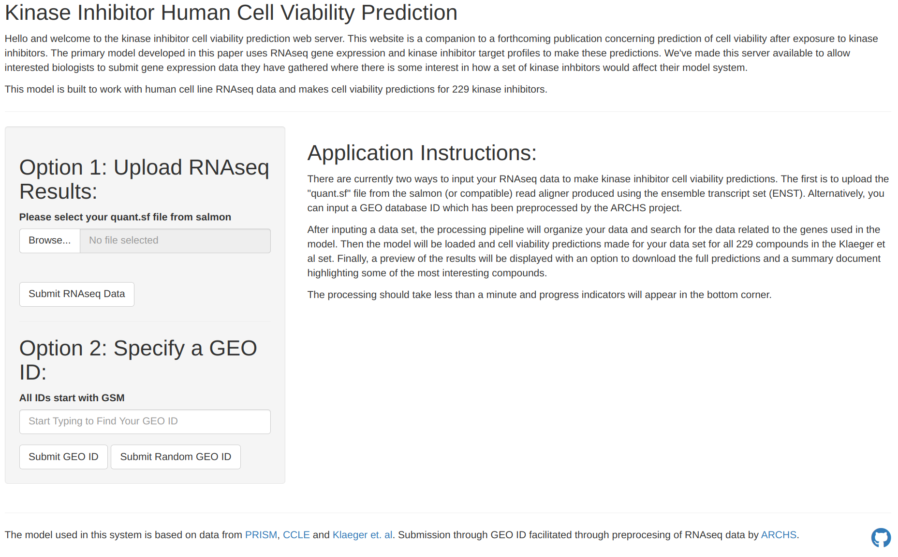

# Kinase Inhibitor Prediction Application

This repository contains the code related to the Kinase Inhibitor Prediction Application. The application was built using the R shiny framework and uses a model developed in a seperate [project](https://github.com/gomezlab/PRISM_perturbations). You can access the application through our [website](FINAL URL).



## Running the Application Locally

In addition to the above website, the application can also be run on your personal computer. After cloning the repository you will need to download two additional files that are too large to store on github:

* model_only_500feat_100trees.rds: This is the model file used by the system to predictions. (~350 MB) ZENODO LINK
* matt_model_matrix.h5: This is a subset of the data available through [ARCHS](https://maayanlab.cloud/archs4/) customized to only contain the RNAseq data needed for the model. It should be put in "data/ARCHS_subset/matt_model_matrix.h5", this file is unnecessary if you only plan on running your own RNAseq data through the system. (~160 MB) ZENODO LINK

After setting up these additional files, the easiest way to start the application is through R Studio by openning the .Rproj file and then clicking the "Run App" button. Alternatively, you can also start the application with this R command:

```{r}
shiny::runApp()
```

I've also made a [`short script`](package_check.R) to check for any missing packages and install them using the pacman library.

## Reproducibility

Since this work is largely based around making an applicaion available to use a previously described model, there isn't much to say here. We do describe producing a reduced model to make it feasible to make the service available and the methods to reproduce this is described in another [github repository](https://github.com/gomezlab/PRISM_perturbations).
